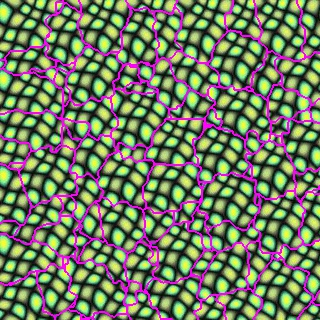

# Graphcut Texture实验报告

2017011305 安頔

---

[TOC]


## 一、项目简介

### 	1、依赖项				

```
cmake >= 3.17
opencv >= 4.5.0
需要支持C++11编译选项
```

### 2、目录结构	

|     目录/文件      |                            功能                             |
| :----------------: | :---------------------------------------------------------: |
|       data/        |      提供的三种纹理和鹰嘴豆纹理，及用于影像拼接的图片       |
|      main.cpp      |                          代码入口                           |
|      include/      |                         头文件目录                          |
|        src/        |                        代码文件目录                         |
|   CMakeLists.txt   |                          cmake文件                          |
| cmake-build-debug/ |                   cmake编译生成的输出目录                   |
|  result/overall/   | 纹理图片生成结果，包含四种纹理生成的320x320图片及接缝示意图 |
|   result/blend/    |                        影像拼接结果                         |

### 	3、使用简介

​	在项目目录下使用cmake：

```
cmake CMakeLists.txt
```

​	生成的可执行文件在`cmake-build-debug/GraphCut-Textures`，直接运行即可

​	其中`main.cpp`中主函数如下：

```C++
int main() {
    //blend();
    auto *graph_cut = new GraphCut("../data/green.gif");
    graph_cut->set_choose_option(kLocalBestChoice);
    graph_cut->set_para_k(0.1);
    graph_cut->set_use_grad(false);
    if(graph_cut->run(320, 320, 50))printf("DONE\n");
    else printf("ERROR\n");
    graph_cut->storeSeam("../result/overall/test_seam.jpg");
    graph_cut->store("../result/overall/test.jpg");
    delete graph_cut;
    return 0;
}
```

​	被注释掉的`blend`的函数实现了根据`data/front_edit.jpg`将`data/front.jpg`和`data/background.jpg`进行图像融合的功能，具体参见附加功能介绍`影像拼接`

​	`main`函数中新建`GraphCut`类的读取路径是输入的纹理图片的途径，后面三行分别设置的是偏移生成算法，后两种偏移生成算法的参数k，是否在接缝能量函数中加入梯度信息。

​	其中三种偏移算法的参数选项依次为：

```python
kRandomChoice
kGlobalBestChoice
kLocalBestChoice
```

​	参数k的设置默认值为`0.1`，参数k越大，随机性会越强。因此对于随机性较大的纹理，可以适当调大k，对于较为规则的纹理，建议适当减小k。

​	如果想在接缝能量函数中引入梯度信息，调用`set_use_grad(true)`即可，默认值为`false`

​	设置完参数之后运行`run`函数，参数依次为生成图片的高度，宽度和在覆盖满生成图片后进行refinement的迭代次数。请注意生成图片的高度，宽度至少要大于等于原纹理图片的高度和宽度，如果`run`函数成功运行完成，最后会输出`DONE`，否则会输出`ERROR`

​	`storeSeam`和`store`两个函数分别是保存接缝图和最终生成图像，参数为保存路径。

​	代码实现中，`MaxFlow`类的功能是最大流算法，`Texture`类的功能是基础的读取图片和查询图片信息，GraphCut-Texture的主体算法部分在`GraphCut`类里面。

### 4、采分点

- 基础的块切割算法
- 三种偏移生成算法
- 考虑old cuts和surrounded regions
- 在能量函数中引入梯度信息
- 使用2D FFT进行加速
- 在未覆盖满和覆盖满时候不同的选择策略
- 影像拼接的简单实现（无GUI）


## 二、算法思路介绍

### 1、基础的块切割算法

​	对于当前图像和纹理的重叠区域，建图，建图规则如下：

```
- 令源点为0，汇点为1，重叠区域的点依次向后标号
- 对于每个重叠区域的点，扫描它上下左右四个方向上的点：
	- 扫到的点属于重叠区域，则按照接缝能量函数的定义计算边权并连接
	- 扫到的点不属于重叠区域，统计它是在新放置的纹理图像中还是在原有图像中
	- 如果这个点在重叠区域的边界，如果周围的点中属于原有图像的较多，则从源点到该点连一条边权为+oo的边；否则，
	从该点到汇点连一条边权为+oo的边
```

​	需要注意的是，这里的网络流建图是无向图，正反向边的容量是相等的；同时代码实现中需要注意加边顺序，避免同一条边被添加两次。

​	接缝能量函数的定义如下：
$$
M(s, t, A, B) = ||A(s)-B(s)||+||A(t)-B(t)||
$$
​	之后使用基于bfs和dfs求增广路的`dinic`算法求解网络流。在网络流求解完成后，从源点开始dfs，容量为0的边视为不存在，这样可以得到从源点遍历到的点集S。对于点集S中的像素点，颜色保持不变；对于不在点集S中的重叠区域的像素点，颜色与新放置的纹理图片对应颜色一致。

​	对于新放置的纹理图片中的非重叠区域，直接更新对应像素点的颜色即可。

 


### 2、三种偏移生成算法

#### 2.1 随机生成偏移算法

​	为了优化最终生成效果，实现的随机生成算法并不是完全随机的。定义可选择的放置方案满足条件如下：

- 重叠区域像素数量 >= 纹理图片像素数量*min_overlap，这里min_overlap取0.1
- 在未覆盖满生成图片前，新放置的纹理图片必须要覆盖到之前未被覆盖的像素点

​    先通过遍历每一个偏移量，选择满足条件可放置的偏移量的集合，然后在这个集合里进行随机选取。判断重叠区域的像素数量和是否覆盖未覆盖的像素点可以使用二维前缀和进行预处理后进行查询。




​	可以看出随机生成偏移算法在生成随机纹理时有一定的效果，但是在面对结构性较强的纹理时并不能产生较好的结果

#### 2.2 匹配整个块的最佳位置

​	定义**error_region**为图像中接缝能量损失最大的区域，大小固定为纹理图片的1/9（高是纹理图片高的1/3，宽是纹理图片的1/3）。此外，如果当前图像未覆盖满所有像素点，则**error_region**必须覆盖之前未覆盖掉的像素点。

​	接缝能量损失可以在块切割算法中进行记录，同时可以使用二维前缀和预处理加速区域接缝能量损失查询。这样可以通过遍历图像来找到当前的**error_region**。

​	在确定**error_region**之后，先遍历每一个偏移量，舍去纹理图片不能完整覆盖**error_region**的偏移量，对于符合条件的偏移量t，按照以下式子计算SSD cost：
$$
C(t) = \frac{1}{|A_t|}\Sigma_{p\in A_t}|I(p)-O(p-t)|^2
$$
​	即重叠区域的色差向量的模长的平方的平均值，令
$$
p(t)=e^{-C(t)/k\sigma^2}
$$
​	以$\frac{p(t)}{\Sigma p(t)}$的概率选取偏移t，其中`k`是可以设置的参数，通常情况下`k=0.1`效果较好。$\sigma^2$是当前图像的像素值的方差。

​	在实际实现2D FFT算法加速之前，计算SSD是非常慢的。可以使用如下方法对选取概率进行近似以加速：

```
- 设置参数T
- 随机T个可行偏移量t
	- 对于每个偏移量计算SSD cost
- 选取SSD cost最小的偏移量作为选择结果
```

​	设置`T=200~1000`时就已经有相当不错的效果了


​	

#### 2.3 匹配子块的最佳位置

​	对于**error_region**的选取规则同2.2，在选取完**error_region**后，为了增加每次迭代时新覆盖的像素数量，将**error_region**向外扩大一圈作为纹理子块在图像中的匹配位置。

​	之后在纹理图片中遍历每一个子块，按照以下式子计算SSD cost：
$$
C(t) = \frac{1}{|S_o|}\Sigma_{p\in S_o}|I(p-t)-O(p)|^2
$$
​	这里相比论文的式子增加了归一化，原因是实际实现中发现$C(t)$可能会很大，在计算$p(t)$的可能会出现精度问题导致概率变为0。之后的计算$p(t)$的方式和选择概率与2.2是一致的，同样也可以使用同2.2里随机化的方法对选取概率进行近似以加速。


### 3、考虑old cuts和surrounded regions

​	对于old cuts，记录每次块切割后产生的接缝，在网络流建图的时候，如果重叠区域的两个点$s, t$需要建边且这两个点之间有接缝存在，记两个点分别来自于纹理图像$A_1,A_2$，新放置的纹理图像为B，则建边规则修改如下：

```
- 新建图节点表示当前接缝，从接缝节点向汇点建边，边权为M(s, t, A_1, A_2)
- 从s节点向接缝节点连边，边权为M(s, t, A_1, B)
- 从接缝节点向t节点连边，边权为M(s, t, B, A_2)
```

​	因为这三个边权满足三角不等式，所以在网络流求最小割的过程中，最多只会切割一条边，保证了new cut会捕不差于old cut，之后的做法与基本块切割算法一致。

​	对于surrounded regions，如果区域内存在接缝，则存在到汇点的边，也就存在从源点到汇点的增广路径。如果区域内不存在接缝，则该区域完全来自一张纹理图片，是没有必要对这片区域进行refinement的。

​	因为M函数满足三角不等式，因此在覆盖满所有像素之后，使用GraphCut可以继续对现有接缝进行优化，保证了整体的接缝能量损失在优化过程中是单调的，也就保证了算法的正确性。


### 4、在能量函数中引入梯度信息

​	将能量函数修改为
$$
M(s, t, A, B) = \frac{||A(s)-B(s)||+||A(t)-B(t)||}{||A(t)-A(s)||+||B(t)-B(s)||}
$$
​	引入了梯度信息，使得最小割更容易选取梯度变化较大的地方进行切割。实际代码实现中，分母可能会出现0的情况，此时认为分母为1即可。

​	该方法对于一些较为规则的纹理图片存在一定的优化效果。


### 5、使用2D FFT加速

​	偏移生成算法2和3都可以使用2D FFT进行加速，其思路基本上是一致的。这里只介绍对于2的式子的2D FFT加速。	
$$
|I(p)-O(p-t)|^2 = I^2(p)-2I(p)O(p-t)+O^2(p-t)
$$
​	其中$I^2(p)$这一项可以使用二维前缀和进行求解加速。

​	$I(p)O(p-t)$这一项对于纹理图像在生成图像的高度$h$和宽度$w$下进行水平和垂直的翻转，式子可以改写成$I(p_x, p_y)O(h-1-p_x+t_x, w-1-p_y+t_y)$，很容易发现这是满足二维卷积的形式的，可以使用2D FFT进行加速计算。

​	对于最后一项$O^2(p-t)$，由于求解的是重叠区域的SSD cost，因此在未完全覆盖满所有像素之前，这一项不是定值。需要构建与图像$I$等大小的二维矩阵$I_{mask}$，对于图像$I$中被覆盖的像素点，记为1，否则记为0。同时对图像$O$构建图像$O_2$，即对每一个像素的每一个通道值求平方，然后将$O_2$在生成图像的高度$h$和宽度$w$下进行水平和垂直翻转，求解$O_2$和$I_{mask}$的二维卷积，即可加速求解重叠区域的$O^2(p-t)$这一项的值。

​	对于2D FFT的实现，实现中调用了opencv提供的dft库函数，对图像的每一个通道做dft变换后相乘，然后在做idft变换将各个通道得到的值相加。

```c++
cv::Mat GraphCut::fft(Texture *a, Texture *b) {
    cv::Mat tmp_a_channels[3], tmp_b_channels[3];
    cv::split(a->texture, tmp_a_channels);
    cv::split(b->texture, tmp_b_channels);
    cv::Mat a_channels[3], b_channels[3];
    for(int i = 0; i < 3; ++i){
        a_channels[i] = cv::Mat_<float>(tmp_a_channels[i]);
        b_channels[i] = cv::Mat_<float>(tmp_b_channels[i]);
    }
    int dft_m = cv::getOptimalDFTSize(a_channels[0].rows+b_channels[0].rows-1);
    int dft_n = cv::getOptimalDFTSize(a_channels[0].cols+b_channels[0].cols-1);
    cv::Mat conv_ans = cv::Mat::zeros(dft_m, dft_n, CV_32F);
    for(int i = 0; i < 3; ++i){
        cv::Mat dft_a = cv::Mat::zeros(dft_m, dft_n, CV_32F);
        cv::Mat dft_b = cv::Mat::zeros(dft_m, dft_n, CV_32F);
        cv::Mat dft_a_part = dft_a(cv::Rect(0, 0, a_channels[i].cols, a_channels[i].rows));
        cv::Mat dft_b_part = dft_b(cv::Rect(0, 0, b_channels[i].cols, b_channels[i].rows));
        b_channels[i].copyTo(dft_b_part);
        a_channels[i].copyTo(dft_a_part);
        cv::dft(dft_a, dft_a, 0, a_channels[0].rows);
        cv::dft(dft_b, dft_b, 0, b_channels[0].rows);
        cv::mulSpectrums(dft_a, dft_b, dft_a, 0, false);
        cv::idft(dft_a, dft_a, CV_HAL_DFT_SCALE, a_channels[i].rows+b_channels[i].rows-1);
        conv_ans = conv_ans+dft_a;
    }return conv_ans;
}
```

​	对于偏移算法3的2D FFT加速方法与上面类似，不再赘述。


### 6、在未覆盖满和覆盖满时候不同的选择策略

​	在未覆盖满的时候和覆盖满时候的不同偏移生成算法选择策略之前已有所说明，不再赘述。

​	实际实现中，对于生成一张高度$h$和宽度$w$的合成纹理图像，分成了两步来做。第一步是生成覆盖满全部像素的图像，第二步是对图像进行refinement。

​	在第一步中，由于新放置的位置可能会产生新的接缝损失，因此整体接缝能量的损失是不固定的。而在第二步，因为考虑old cut的能量函数满足三角不等式，因此整体接缝能量的损失必然是单调递减的，当整体接缝能量损失收敛或者到达规定的迭代次数时即可生成最终的合成纹理图像。

​	

### 7、影像拼接的简单实现

​	取论文中的图，参见`data/front.jpg​`和`data/background.jpg`，进行简单的人工图像编辑生成`data/front_edit.jpg`，其中画黑线的部分是编辑时我认为`front.jpg`在拼接的时候应该保留的信息。

​	`blend`函数中先读取以上三张图片，对重叠区域建图，其中对于画黑线的部分强制连接一条+oo的边到汇点，求割。根据求出来的割可以得到`mask`，对`mask`进行简单的腐蚀和高斯模糊操作后，将两张要拼接的图像依照`mask`进行融合，就可以得到相当不错的效果。

​	拼接效果如下：


 

## 三、总结和收获

### 1、结果展示

根据对比，使用整块匹配最终合成的效果较好，以320x320为合成图像的高和宽，结果展示如下：


### 2、实现过程中的遗憾

​	第一个遗憾是关于在接缝能量函数引入梯度信息这一项中，尽管实现这个功能非常简单，但是实际效果并不理想。经过分析，我认为这是因为在引入梯度信息之后，考虑old cut的建图是不能保证三角不等式成立的，这就导致求最小割的时候会出现问题，从而导致了生成质量的下降。

​	第二个遗憾是关于子块匹配的算法，由于error_region找到的位置并不能产生很多的新像素，这就导致子块匹配算法在到铺满整个画面过程中的迭代次数会很多，耗时较长。同时也会产生过多无意义的接缝。在这方面应该还是有优化余地的，但是我尝试了很多能够增大error_region覆盖像素数量的方案，但是往往都是以生成质量的下降为代价的。

​	第三个遗憾就是由于在理解论文和反复修改实现的过程中耗费了过多的时间，导致没有足够的时间和精力去完成GUI了，影像拼接也只是进行了简单的实现，并没有形成规范的接口。

### 3、收获

​	在反复修改实现的过程中，我意识到了从理解论文的大致思路到真正写出代码做出较为漂亮的实现，是需要付出很多努力，踩很多坑，走许多弯路的。在实际工程实践的过程中，一定要先对整体的实现有一个较为清晰的认识，才能在写起来得心应手。

​	媒体计算是一门非常有趣的课，效果非常直观，而且目前来看可解释性很强，也有很多有意思的应用场景。

​	感谢老师的教导和助教的批阅！